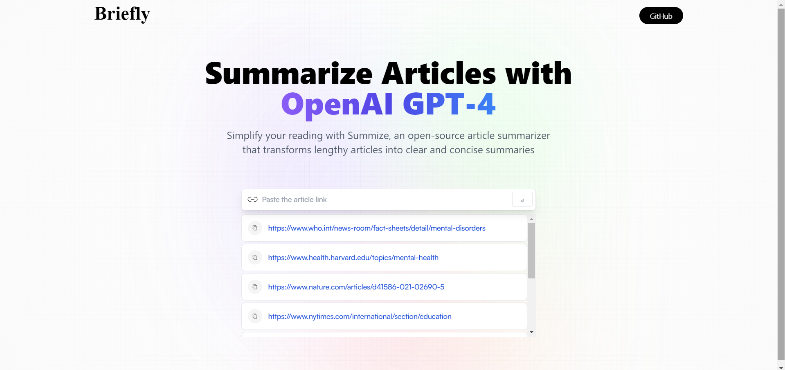
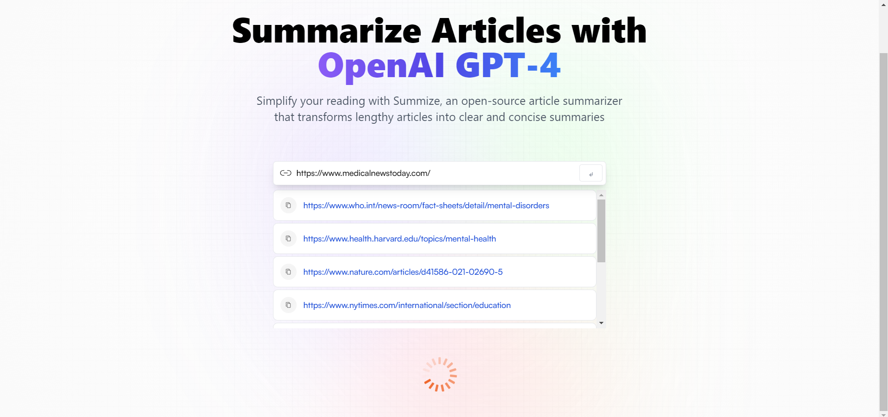

# 📰 Breifly: Where Less is More! 

**Welcome to Breifly!** ✨ Your go-to web app for turning lengthy articles into concise summaries!

## 🌟 What is Breifly?
Breifly is a **React-based web application** that effortlessly transforms **long reads into quick takes**. Whether you’re short on time or just want to grasp the main ideas without sifting through paragraphs, Breifly is here to help!

## 🔗 How It Works
Simply **paste any article or website link**, and watch as Breifly generates a **concise summary** in seconds! 





### 🎉 Key Features
- **Instant Summaries**: Get the essence of lengthy articles with just a click.
- **History Tracking**: Easily revisit your previous searches and summaries.
- **User-Friendly Design**: An intuitive interface that makes summarizing a breeze.

## 💡 Why Choose Breifly?
Whether you're conducting research, catching up on news, or studying on the go, Breifly cuts through the noise, delivering **key insights quickly**. Save time and stay informed effortlessly!

### 🚀 Technologies Used
- **Frontend**: JavaScript, React.js
- **State Management**: Redux
- **Styling**: Tailwind CSS

## 🛠️ Installation

Ready to dive in? Follow these simple steps to get started:

1. **Clone the repository**:
   ```bash
   git clone https://github.com/Aisha-Fathima/AI-Summarizer.git
   cd AI-Summarizer
   ```

2. **Install dependencies**:
   ```bash
   npm install
   ```

3. **Start the development server**:
   ```bash
   npm run dev
   ```

4. **Open your browser** and navigate to `http://localhost:3000` to see Breifly in action!

